# Bert_Ontology
Experiment with training BERT for ontology engeneering.

## General idea of Transfer Learning of BERT
The idea of transfer learning is use the knowledge learned from one task, and use it for another task. 
For example, we can take the an "pre-trained" CNN model trained using all the labeled general images (a large dataset) on ImageNet, and "fine-tune" it as a dog/cat classifier with our own training data (small dataset). \
Pre-training is normally expensive because the model typically with a large number of parameters need to be trained from scratch with a large size of training data.
Fine-tuning is normally cheap because we will reuse the pre-trained model and exploit the "knowledge" it already learned, by training it with a small training dataset for our task-of-interest.

However, if we want, we can continue pre-training the model pre-trained by others. For example, the model we used here is BERT, which is pre-trained by Google using Wikipedia and BookCorpus text data, denoted as BERT_base.
If we want to spice the model with model "medical flavor", we can adopt the same training process Google did but training BERT_base with medical domain text data. We can refer the obtained model as BERT_base_medical. \
Note here we are still in the scope of pre-training. We do not bind our model with any specific task.
After we obtain the BERT_base_medical model, we can add a classifier/regression layer on top of it, say BERT_base_medical_classifier. Then we can fine-tune this new model with the training data for our task.

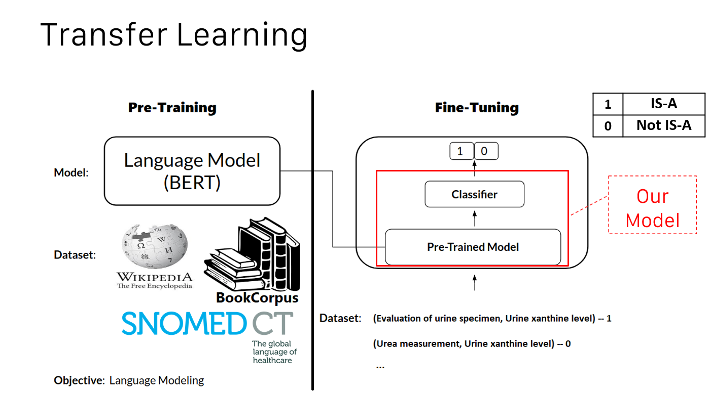

This repository covers both the pre-training and fine-tuning in the following steps:
1. Create pre-training data from medical text (we use SNOMED CT text data)
2. Pre-training the BERT_base (released by Google) model to get BERT_base_sno ('sno' stands for SNOMED)
3. Prepare the training data testing data
4. Fine-tuning the BERT_base_sno model with training data to get BERT_base_sno_clf ('clf' stands for classifier)
5. Test the fine-tuned BERT_base_sno_clf model with testing data
6. Evaluate the model's performance  


---
## Prerequisite: Kong Server 
### SSH to Kong Server
To use Kong, you need to SSH to the Kong server. You are free to use other SSH client to connect to Kong. Here is an example of using MobaXterm for Windows users. 
1. Go to [njit software download](http://ist.njit.edu/software-available-download/)
2. Download and install MobaXterm (for Windows user only).
3. SSH to Kong.njit.edu with port 22.
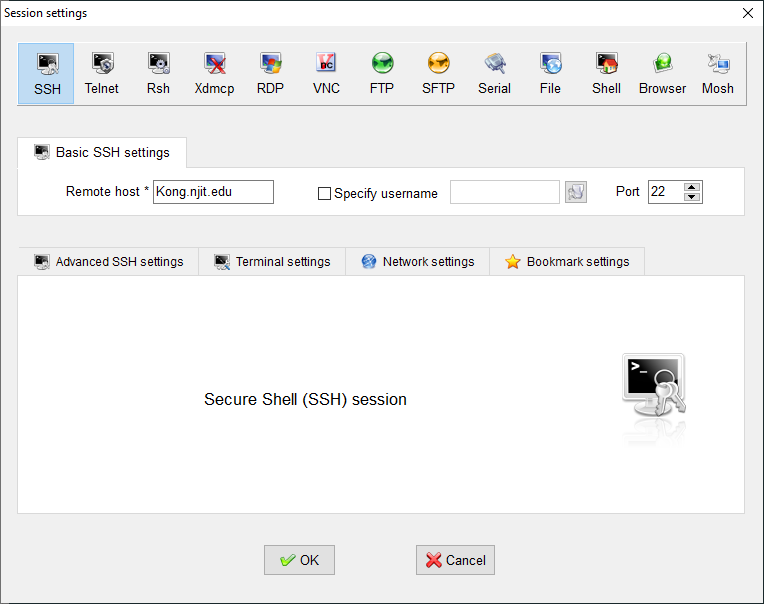
4. Use your NJIT credentials to log in to Kong.
(To acquire Kong access, email arcs@njit.edu and cc your advisor to grant you Kong access and disk space quota. The initial Kong disk quota is 5G.)

### Install Anaconda on Kong (for your own usage)
Kong use Anaconda to manage Python packages for all users. To customize your own Python environment, you need to install Anaconda locally instead of using the Kong's global Anaconda.
1. Download [Anaconda](https://repo.anaconda.com/archive/Anaconda3-2020.02-Linux-x86_64.sh) for linux.
2. Upload the Anaconda3-2020.02-Linux-x86_64.sh to any of your directory on Kong. 
3. Follow the instructions [here](https://docs.anaconda.com/anaconda/install/linux/) to install Anaconda.
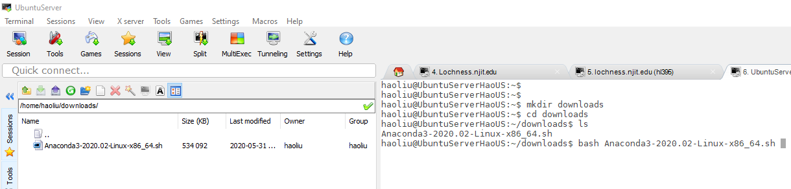
4. Use `which conda` to make sure you are using you installed conda instead of Kong global conda.
5. (Optional) Downgrade python from 3.7 to 3.6 `conda install python=3.6`. 
6. Update `~/.bashrc` file use `vi ~/.bashrc` or `nano ~/.bashrc` to export the 'anaconda' as your default manager of python. \
Comment out all the setting added by Anaconda installation. Add `export PATH="/home/h/hl395/anaconda3/bin:$PATH"` to the end.
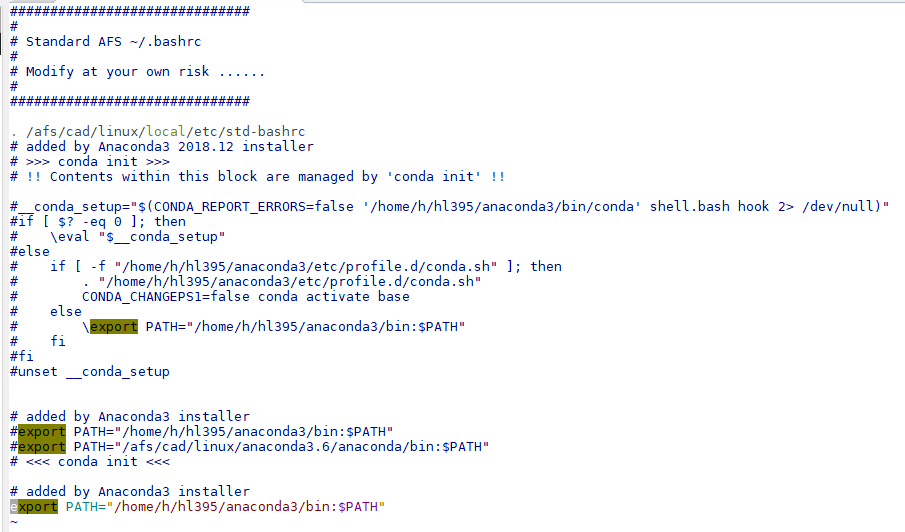
Use `which python` to verify that you are using your local python instead of global python.
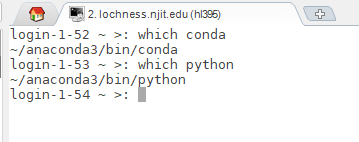


### Run a Job on Kong
In contrast to run a python file using `python my_file.py` as you normally do on your local machine, you need to compose a script and submit this script as a job to Kong server. Kong will schedule this job when the resource is free.
You can follow the steps below to submit a job to Kong:
1. Create your my_file.py and make sure all the required modules/packages are installed by run `conda list`.
2. Create a my_file.sh script follow the [template](TestBert/templates/my_file.sh) in the same directory as the python file you want to execute for simplicity. 
3. Change the following parameters in the script accordingly:
```angular2
    #$ -N job_name  // set job name
    #$ -q datasci  // set queue to run the job
    #$ -node=437   // set to run the job on node437
```
Most importantly, the script should include `python my_file.py` at the end to run your my_file.py.
4. Use `qsub my_file.sh` to submit this job to Kong. You will see a job id assigned to your submission.  
5. Use `qstat -u *Your_UNI* ` to check your job status. 
6. After Kong finishes running your job, the console output will be write to a file named with your job id and job name.

 
### Useful Commands on Kong
```
qstat -f | grep datasci   // show status of all datasic nodes usage

qstat -u *Your_UNI*   // show your own job status

qlogin -l hostname=node437 -q datasci  // log into node 437 

nvidia-smi    // after run the above command, check GPU usage of node 437 
```
### Transfer from Kong to Lochness
```
https://wiki.hpc.arcs.njit.edu/index.php/SGEToSLURM
```
```
# check all queues
sinfo -a
# check all running jobs
squeue -a
# show your own job status
squeue -u *Your_UNI*  
# log into node 437 
ssh node437 
# after run the above command, check GPU usage of node 437 
nvidia-smi    
```
---

## 1. Environment configuration:
### 1.1. Hardware requirement (Recommended or better)
* NVIDIA RTX Titan with 24GB GDDR6 memory
* Driver version == 418.56
* CUDA version == 10.1

This is the default configuration of node437 on Kong. 

### 1.2. Software requirement
* Python 3.6 
* Keras==2.2.4
* matplotlib==3.0.2
* nltk==3.4.1
* numpy==1.16.4
* pandas==0.23.0
* scikit-learn==0.21.2
* tensorflow-gpu==1.13.1


To install required python modules, first, double check which pip you are using with `which pip`. You should use the pip from your local Anaconda.

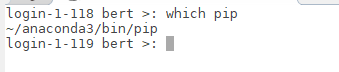
 
Then, run `pip install -r requirements.txt`.  

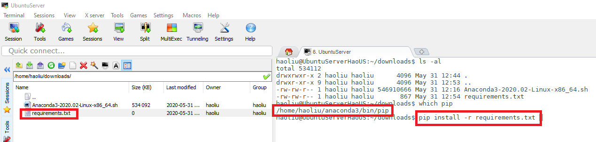


## 2.	Source code
The source code is maintained on GitHub repository with the link below:\
https://github.com/hl395/Bert_Ontology \
The pre-trained BERT model, released by Google can be found at:\
https://github.com/google-research/bert


## 3.	Dataset format
The data format examples for both pre-training and fine-tuning are described below. \
Note that the text data used for training is plain text delimited by line.
The task related training and testing data is labeled data, similar to each image with a label of cat or dog, each training instance is labeled as IS-A or non-IS-A.
The true labels for testing data are also provided for evaluation but not used by our model in its predictions.

You can refer to the format we used here to adjust your own data. 

### 3.1.	Pre-training data format
In general pre-training, the corpus are general English text. The input is a plain text file, with one sentence per line. Documents are delimited by empty lines. The output is a set of tf.train.Examples serialized into TFRecord file format. \
In our task, the pre-training data is concept triples. Each triple contains three concepts, with one concept per line. An empty line is used to separate triples. In cases a focus concept has no parent or child, there are only two concepts in the corresponding triple. 
An example of pre-training data is as follows:
```
congenital anomaly of aorta
congenital stenosis of aorta
congenital supravalvular aortic stenosis

genodermatosis
inherited cutaneous hyperpigmentation
naegeli-franceschetti-jadassohn syndrome

hyperpigmentation of skin
inherited cutaneous hyperpigmentation
terminal osseous dysplasia and pigmentary defect syndrome
```
A short version of the example file for the pre-training data can be found at [pre_training_data_example.txt](TestBert/data/pre_training_data_example.txt) in the GitHub repository.  
     
### 3.2.	Fine-tuning data format
For fine-tuning, we need three files: [train.tsv](TestBert/data/train.tsv) for training, [dev.tsv](TestBert/data/dev.tsv) for validation, and [test.tsv](TestBert/data/test.tsv) for prediction. The “train.tsv” and “dev.tsv” files share the same format while the “test.tsv” is different by hiding the true labels.

To fine-tune BERT as IS-A relationship classifier, we extract IS-A connected concept pairs as positive training sample, and concept pairs that are not connected as negative training sample. Each concept pair is recorded as one string in one line, with the two concepts’ ids and names, and the IS-A label of this pair. The information is organized into five columns: 
* Column “Quality” indicates the IS-A label between the two concepts, i.e. the classification label. 
* Column “#1 ID” represents the SNOMED ID of the first concept. 
* Column “#2 ID” represents the SNOMED ID of the second concept. 
* Column “#1 String” represents the SNOMED name of the first concept. 
* Column “#2 String” represents the SNOMED name of the second concept.

Columns are separated using Tab as the delimiter. 
An example of the fine-tuning data is as follows:
```
Quality	#1 ID	#2 ID	#1 String	#2 String
1	366054000	301976001	finding of fluorescein tear drainage	fluorescein tear drainage impaired
0	295116004	295019008	allergy to chymotrypsin	allergy to mannitol
```
A short version of the three example files, [train.tsv](TestBert/data/train.tsv), [dev.tsv](TestBert/data/dev.tsv), and [test.tsv](TestBert/data/test.tsv) for the pre-training data can be found at the “data” directory in this repository.

### 3.3.	Test data format
To test the trained IS-A relationship classifier, we extract both IS-A connected concept pairs as positive testing sample, and concept pairs that are not connected as negative testing sample. Each concept pair is recorded as one string in one line, with the two concepts’ ids and names. The information is organized into five columns: 
+ Column “Quality” indicates the IS-A label between the two concepts.
+ Column “#1 ID” represents the SNOMED ID of the first concept. 
+ Column “#2 ID” represents the SNOMED ID of the second concept. 
+ Column “#1 String” represents the SNOMED name of the first concept. 
+ Column “#2 String” represents the SNOMED name of the second concept. 

Columns are separated using Tab as the delimiter. 
Note that the IS-A label of this pair is also included for evaluation simplicity. The true label is not visible or used in testing our classifier.
An example of the fine-tuning data is as follows:
```
index	#1 ID	#2 ID	#1 String	#2 String
0	400186008	773629001	neoplasm of integumentary system	onychomatricoma	1
1	298756009	316561000119102	finding of bone of upper limb	osteophyte of left elbow	1
…… 
6734	51868009	735563002	duodenal ulcer disease	cicatrix of middle ear	0
6735	762366009	735906001	prolapse of left eye co-occurrent with laceration	effects of water pressure	0
……
```
A short version of the example file for the pre-training data can be found at [test.tsv](TestBert/data/test.tsv) in the GitHub repository.


## 4. Execute program
### 4.1. Preparation
* a) Use `mkdir mytest` to create a new directory. And use `cd mytest` to navigate to the new directory.
* b) After The program repository can be cloned using command: \
`git clone https://github.com/hl395/Bert_Ontology.git` 

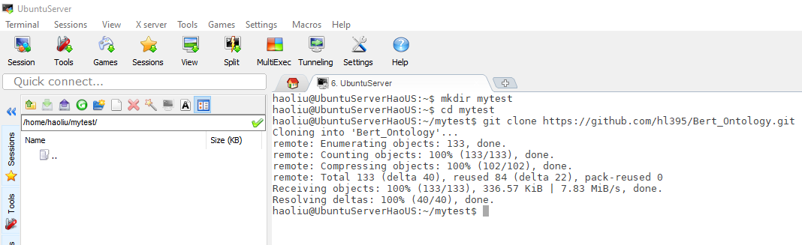

The hardware compatibility and software requirement should be verified before executing the program.  
After clone the repository, you can refresh to see the downloaded program `BERT_Ontology`. \

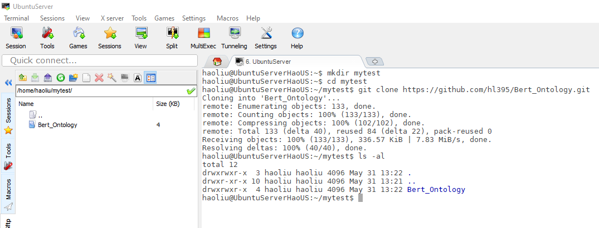

* c) Download the pre-trained BERT model, e.g. BERT-Base, Uncased: 12-layer, 768-hidden, 12-heads, 110M parameters from: \
https://storage.googleapis.com/bert_models/2018_10_18/uncased_L-12_H-768_A-12.zip \
* d) Use `mkdir model` to create a new directory called 'model'. Upload your downloaded BERT-Base model to this `model` directory.

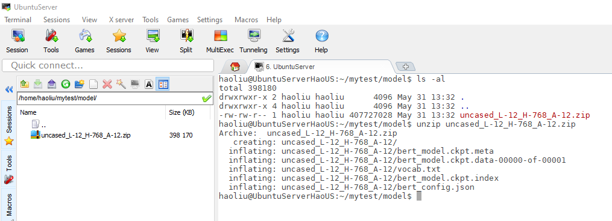

* e) Use `unzip uncased_L-12_H-768_A-12.zip` to unzip the download BERT-base model. \
The downloaded BERT model should include the “vocab.txt” file and “bert_config.json” and three bert checkpoint files, “bert_model.ckpt.meta”, “bert_model.ckpt.index”, and “bert_model.ckpt.data-00000-of-00001”. 

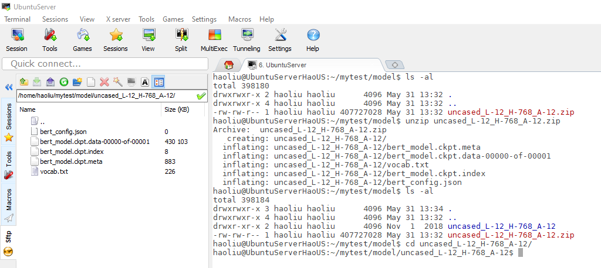


### 4.2. Pre-training
#### 4.2.1.	Create pre-training data
The parameters used to control this data creation are specified in the [creating_pretraining_data.py](TestBert/create_pretraining_data.py). The required parameters include:
  ```
  FLAGS.input_file = “/path/to/pre-training_data_example.txt”
  FLAGS.output_file = “/path/to/tf_examples.tfrecord” 
  FLAGS.vocab_file = “/path/to/downloaded_BERT_model/vocab.txt”
  FLAGS.do_lower_case = True
  FLAGS.max_seq_length = 128
  FLAGS.max_predictions_per_seq = 20
  FLAGS.masked_lm_prob = 0.15
  FLAGS.random_seed = 12345
  FLAGS.dupe_factor = 5
```

The usage of parameters can be referred at the vanilla BERT GitHub page.

To generate pre-training data, run the script [kong_creating_pretraining_data.sh](TestBert/kong_create_pretraining_data.sh) with command `qsub kong_create_pretraining_data.sh`.
Make sure the `creating_pretraining_data.py` and `kong_creating_pretraining_data.sh` are in the same directory and run the submit command from the same directory. If they are not in the same directory, you need to specify the directory. 

After the pre-training data is generated, it is wrote to the output directory named by “tf_examples.tfrecord.” 
 
#### 4.2.2.	Run pre-training 
The parameters used to control pre-training are specified in the [run_pretraining.py](TestBert/run_pretraining_data.py). The required parameters include:
  ```
  FLAGS.input_file = “/path/to/tf_examples.tfrecord” (from 4.2.1)
  FLAGS.output_dir = “/path/to/pre_trained_model_directory” 
  FLAGS.vocab_file = “/path/to/downloaded_BERT_model/vocab.txt” (the same as in 4.2.1)
  FLAGS.do_train = True (perform training)
  FLAGS.do_eval = True (perform evaluation/validation)
  FLAGS.bert_config_file = “/path/to/downloaded_BERT_model/bert_config.json”
  FLAGS.init_checkpoint = “/path/to/downloaded_BERT_model/bert_model.ckpt”
  FLAGS.train_batch_size = 64   
  FLAGS.max_seq_length = 128
  FLAGS.max_predictions_per_seq = 20
  # FLAGS.num_train_steps = 15000
  FLAGS.num_train_steps = 100000
  FLAGS.num_warmup_steps = 5000
  FLAGS.save_checkpoints_steps = 20000
  FLAGS.learning_rate = 2e-5
```

The usage of parameters can be referred at the vanilla BERT GitHub page.

To pre-training the downloaded BERT with our own corpus, run the script [kong_run_pretraining.sh](TestBert/kong_run_pretraining.sh) with command `qsub run_pretraining.sh`.
After pre-training the BERT model, the obtained new model is saved to the output directory in “/path/to/pre_trained_model_directory” where the value of “FLAGS.output_dir.” 

Note that the obtained new model’s name could vary depends on the number of training steps are used. However, the model still consists of three files and checkpoint file. An example using the parameters above will generate a model with three files as follows: “model.ckpt-100000.meta”, “model.ckpt-100000.index”, and “model.ckpt-100000.data-00000-of-00001” with the same number 100000 in their names as it is the value used as the number of training steps.

### 4.3. Fine-tuning
To fine-tune the obtained model from 4.2, we run [run_classifier_hao.py](TestBert/run_classifier_hao.py) with specifying the following required parameters:
```
FLAGS.bert_config_file = “/path/to/downloaded_BERT_model/bert_config.json”
FLAGS.vocab_file = “/path/to/downloaded_BERT_model/vocab.txt"
FLAGS.init_checkpoint = “/path/to/pre_trained_model_directory” (in 4.2.2) 
FLAGS.data_dir = “/path/to/fine_tuning_data_directory/” (the directory that contains the both fine-tuning training, evaluation, and testing data)
FLAGS.output_dir = “/path/to/fine_tuned_model_directory/"
FLAGS.train_batch_size = 64  
FLAGS.max_seq_length = 128
FLAGS.num_train_epochs = 3
FLAGS.do_train = True (perform training)
FLAGS.do_eval = True (perform evaluation/validation)
FLAGS.do_predict = True (perform prediction)
FLAGS.task_name = "MRPC" 
```

The usage of parameters can be referred at the vanilla BERT GitHub page.
To fine-tune the pre-trained BERT with concept pairs, run the script [kong_run_classifier_hao.sh](TestBert/kong_run_classifier_hao.sh) with command `qsub run_classifier_hao.py`.
After fine-tuning the BERT model as an IS-A relationship classifier, the obtained classifier is saved to the output directory in “/path/to/fine_tuned_model_directory” where the value of “FLAGS.output_dir” is specified. 

### 4.4. Testing
The testing is performed after the model is fine-tuned in 4.3, because we turn on the flag for prediction by setting `FLAGS.do_predict = True`. \
The fine-tuned model’s prediction is saved in the “test_results.tsv” file in the directory of “/path/to/fine_tuned_model_directory.” \
Note that we only need to fine-tune the model once, and then use the obtained model to test on different testing data. \
This can be achieved by update the testing sample, i.e. “test.tsv” file with new testing data, and set the `FLAGS.do_train = False` and `FLAGS.do_eval = False`.

### 4.5. Evaluation
For each testing concept pair, our model predicts the probabilities that the two concepts should be connected by IS-A and not, respectively. The results are recorded in the “test_results.tsv” file. \
Use “output/read_results.py” to read the true results and prediction results to evaluate the model’s performance. Note that you need to specify the directory of the "test.tsv" file and the “test_results.tsv” file inside the read_results.py. \
The metrics used including Precision, Recall, F1 and F2 scores, the micro average and macro average of these metrics are also calculated. 


